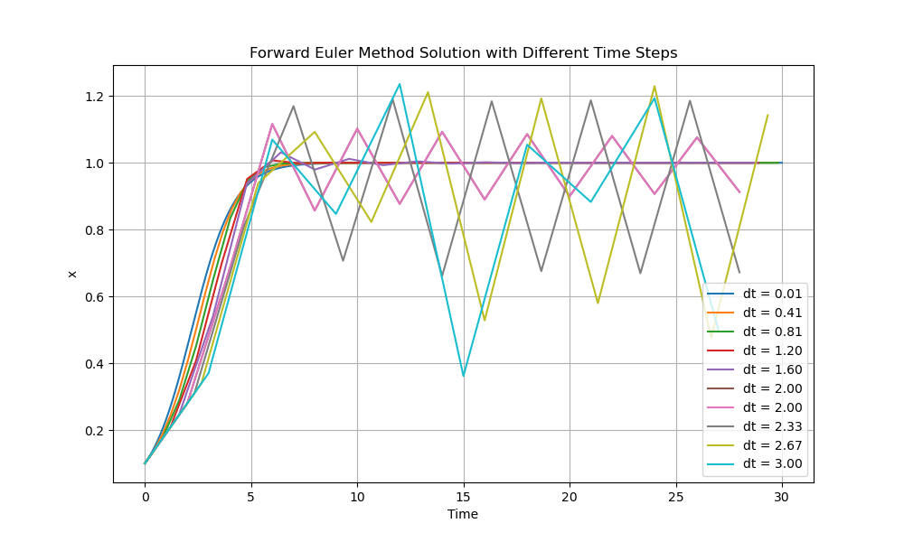
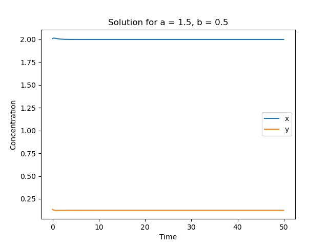
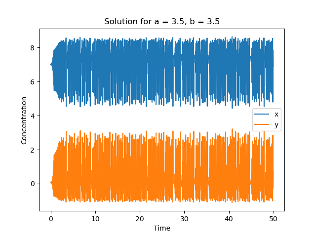
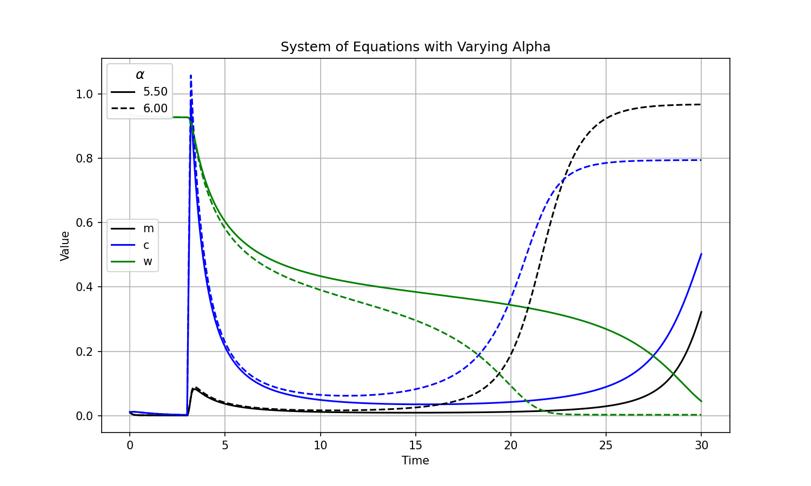

# HW 2 - PHYS 305
## Question 1

For small values of $\Delta t$ (e.g, 0.01 to 2), the solution converges smoothly
to a steady state around $x = 1$. But, for larger values of $\Delta t$ (e.g, 2 to 3), the solutions diverge and become unstable and oscillatory, with increasing divergence from the true steady-state behavior.

*Figure 1: Solution to the equation using forward Euler method for different values of $\Delta t$.*

## Question 2
In order to find the equilibrium solution, we set the derivative of the function to zero and solve for $a, b$:

$$ \frac{dx}{dt} = a - x - x^2 y = 0 $$
$$ \frac{dy}{dt} = b - x^2 y = 0 $$

Solving the above equations, we get $x_{eq} = a + b, y_{eq} = b / (a + b)^2$.

In order to plug to the semi-implicit backward Euler method, we need to solve the following equations to get:
$$x_{i} = \frac{\Delta t (a + x_{i-1}^2 y_{i-1})}{1 + \Delta t}$$
$$y_{i} = y_{i - 1} + \Delta t (b - x_{i-1}^2 y_{i-1})$$

I set a small value of $\epsilon = 0.01$ to check if the solution converge to their equilibrium values or oscillate. The solution converges to the equilibrium values if $a = 1.5, b = 0.5$. But, if $a = 3.5, b = 3.5$, the solution oscillates around the equilibrium values.

 

*Figure 2: Solution to the equation using semi-implicit backward Euler method for different values of $a, b$.*

## Question 3

The equilibrium switches at $\alpha = 6$. The plot showing the equilibrium values of the functions with respect to time is shown below with various alpha is shown below.

*Figure 3: Solution to the system of equations using Runge-Kutta method for different values of $\alpha$.*