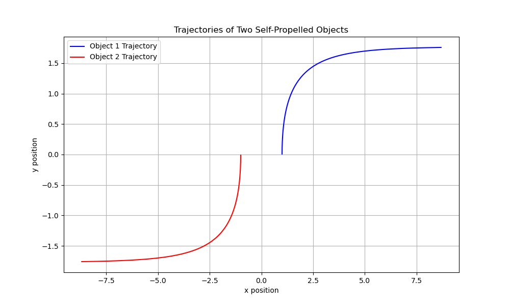
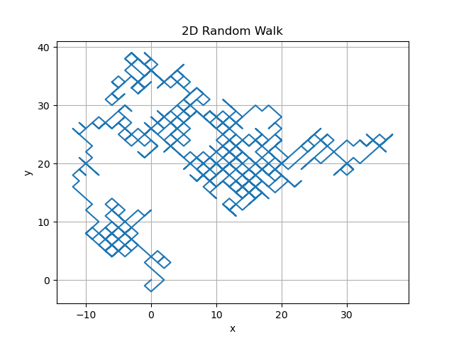
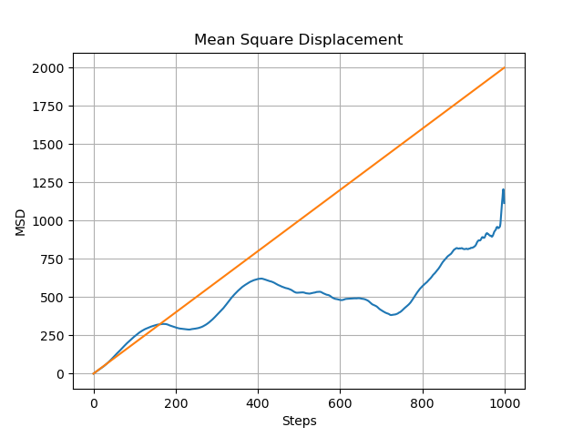
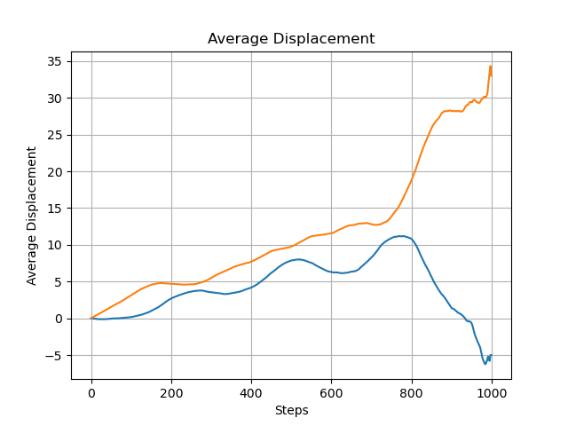
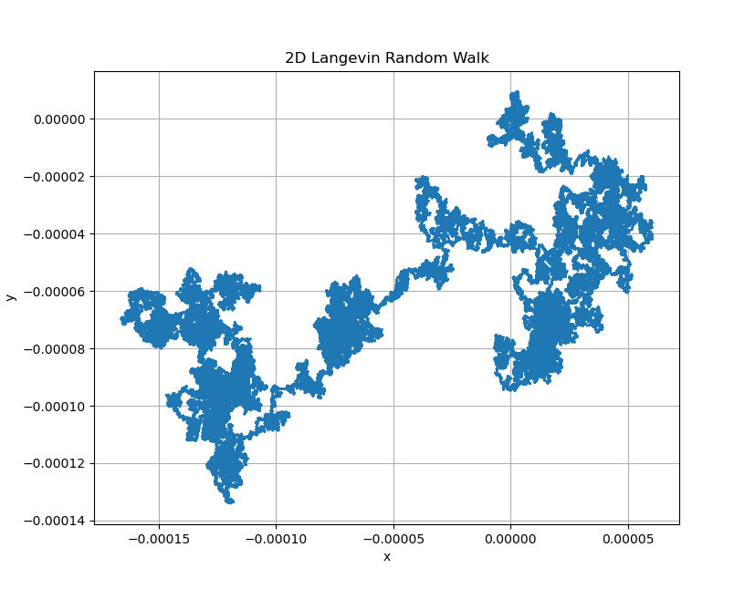
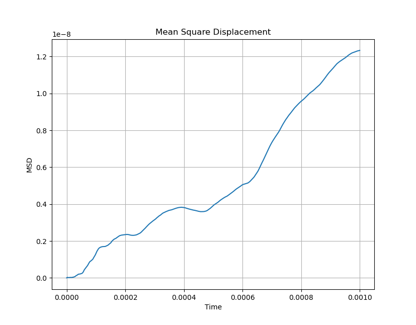

# HW 4 - PHYS 305
## Question 1

The simulation reveals that the two objects initially move in straight paths but gradually curve due to their mutual interactions. As time progresses:

Object 1 (blue trajectory) turns towards positive
y-direction as its velocity and orientation change under the influence of Object 2.
Object 2 (red trajectory) mirrors this effect, moving in the opposite direction but still influenced by Object 1's motion.

The resulting trajectories show how the velocities and orientations of the objects entrain and interact, leading to synchronized but distinct curved paths.

## Question 2

For the 1000 step random walk, the sqaured displacement as a function of steps 
is plotted in the figure below. The plot shows that the squared displacement
increases linearly with the number of steps. The theoretical slope of the line is 1.0 (orange). But, in the plot, the slope isn't a straight line (blue) and is jagged.

The average displacement for x (Blue) and y (Orange) directions are plotted below.

The average displacement for x at the end point was -5 and the expected value of
the mean squared displacement is 1114. So as we discussed in class, the average
2D random walk will be close to zero if we take a large number of steps. This is based on the fact that the 1D random walk is a symmetric walk and the average displacement is zero. The 2D random walk is a symmetric walk in both x and y directions. So, the average displacement in both directions will be close to zero. The expected value for MSD is $2Nb^2$ but we got a value of 1114 as opposed to 2000.

## Question 3
The simulation of the 2D Langevin dynamics for a Brownian particle showed that the particle’s trajectory is random and erratic, as expected for Brownian motion. The random thermal forces cause the particle to move unpredictably in two dimensions over time, with its path reflecting the interplay between stochastic forces and drag. This motion was visualized in the 2D trajectory plot, confirming the particle's diffusion through water at room temperature.

The Mean Squared Displacement (MSD) plot initially exhibited a quadratic increase with time, consistent with the inertial regime where the particle retains its velocity. As time progressed, the MSD transitioned to linear growth, indicating the onset of the diffusive regime where random collisions dominate and inertia becomes negligible. The final MSD at the end of the simulation was approximately 

