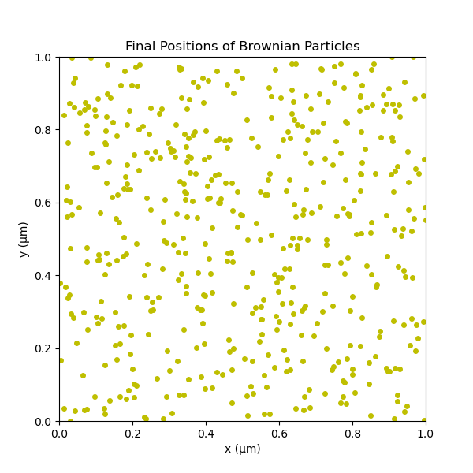
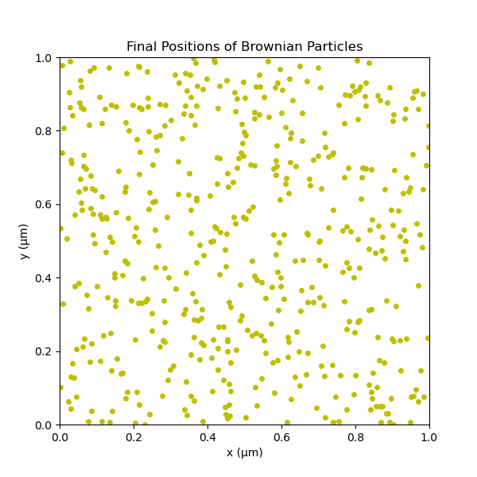
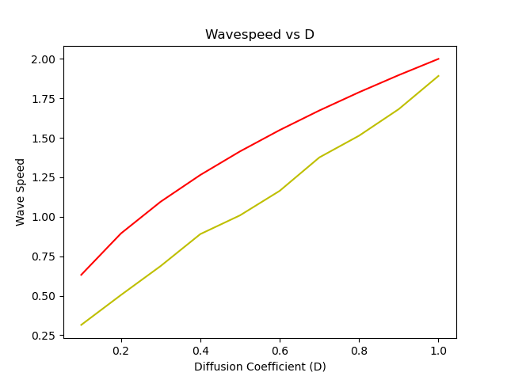

## Question 1
If the depth of the potential well is greater than a few $k_BT$, thermal energy alone is generally not enough to pull particles apart. This results in particles becoming "trapped" in the potential well, where they experience an attractive force that holds them together, ultimately leading to aggregation. The well depth, determined by $\epsilon$, needs to be larger than the average thermal energy ($k_BT$) of most particles to ensure this effect. When $\epsilon$ is sufficiently high relative to $k_BT$, particles within the well are more likely to stay together rather than separating due to thermal fluctuations.

The parameter $\sigma$ represents the distance at which the potential between particles transitions from repulsive to attractive. It determines the size of the particles and the distance at which the potential energy is minimized. Therefore, for aggregation to occur effectively, $\sigma$ should be close to the particle diameter, ensuring that the particles are within the attractive range. Having a smaller $\sigma$ implies a closer, stronger interaction range, creating a "well" that is hard to escape and allows particles caught within it to aggregate at close distances.

## Question 2
For the time step in a simulation, we want it to be small enough that particles travel no more than about 10% of their diameter per step to avoid inaccuracies. Since the particles have a 10 nm radius (20 nm diameter), the maximum distance we aim to cover per time step is around 2 nm. Given this, we calculate the time step ($\Delta t$) by dividing this distance by the particle's maximum velocity. We may also cap the forces or velocities to prevent the particles from traveling too far in a single time step, ensuring stable and accurate simulation results.

## Question 3
1. **Aggregation Scenario**: When the depth of the Lennard-Jones potential well ($\epsilon$) is set high, particles experience a strong attraction that keeps them close together. This leads to clustering or aggregation, as thermal fluctuations are not strong enough to overcome the attractive force holding the particles within the potential well. This behavior is evident in the simulation where particles form dense clusters.

2. **Dispersion Scenario**: With a low value of $\epsilon$, the attractive force between particles is weak, allowing thermal fluctuations to dominate and prevent clustering. As a result, particles are more likely to remain dispersed throughout the box, as seen in the simulation where particles are spread more uniformly. This outcome illustrates that when $\epsilon$ is small, the particles do not aggregate. 

These scenarios confirm that setting $\epsilon$ higher than the thermal energy ($k_BT$) promotes aggregation, while lower values lead to dispersion.

## Question 4
The code solves Fisher’s equation, modeling the spread of a replicating species with diffusion and logistic growth terms. Using finite differences for the diffusion term for the growth term, the solution tracks how the wavefront moves across a spatial domain. We ran the code for 20 seconds.

To find the wave speed, the code records the time it takes for the wavefront to pass two fixed points, allowing the calculation of speed as $\text{wave speed} = \Delta x / \Delta t$. Results show that the wave speed $c$ is proportional to $\sqrt{D}$, confirming the theoretical relation $c \approx 2 \sqrt{D}$. But our calcuations didn't follow the trendline exactly (it was close). The plot illustrates this dependency by comparing calculated speeds with the theoretical $2 \sqrt{D}$ line.

