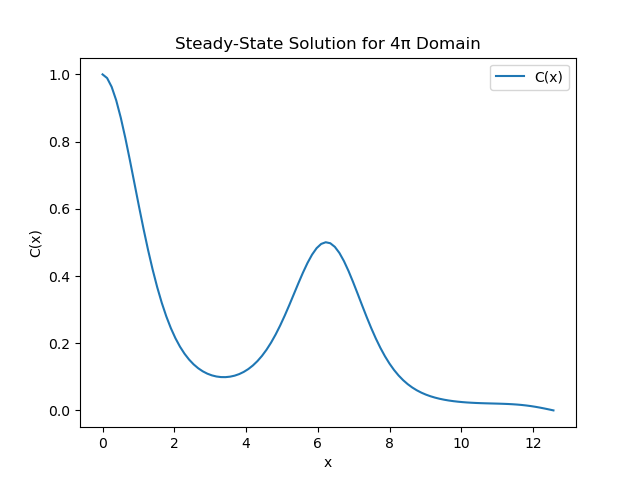

## Question 1
Steady state equation:
$$
0 = \frac{d^2C}{dx^2} - \frac{d}{dx} (\sin(x) \cdot C).
$$

After discretization, we get:
$$
0 = \frac{C_{i-1} - 2C_i + C_{i+1}}{dx^2} - \frac{\sin(x_{i+1}) C_{i+1} - \sin(x_{i-1}) C_{i-1}}{2dx}.
$$

So also enforcing the boundary conditions,
For the boundaries:
- $C(0) = C_0$
- $C(L) = C_L$

Plotting the solution for $C_0 = 1$ and $C_L = 0$ gives:

## Question 2
$
\begin{bmatrix}
-1 & 1 & 0 & 0 & 0 & -1 \\
1 & -3 & 1 & 0 & 0 & 0 \\
0 & 1 & -3 & 1 & 0 & 0 \\
0 & 0 & 1 & -3 & 1 & 0 \\
0 & 0 & 0 & -1 & 1 & 1
\end{bmatrix}
$

Using gauss jordan elimination for this matrix (with my code attached), we get the solution:
$
\begin{bmatrix}
1.75 & 0.75 & 0.50 & 0.75 & 1.75
\end{bmatrix}
$

## Question 3
A. The semi-implicit Backward Euler discretization is:

$$
\frac{\partial u}{\partial t} \approx \frac{u_{i}^{n+1} - u_{i}^{n}}{\Delta t}
$$

$$
\frac{\partial^2 u}{\partial x^2} \approx \frac{u_{i+1}^{n+1} - 2u_{i}^{n+1} + u_{i-1}^{n+1}}{\Delta x^2}
$$

$$
u^2 (1 - u) \approx (u_i^n)^2 (1 - u_i^n)
$$

$$
\frac{u_{i}^{n+1} - u_{i}^{n}}{\Delta t} = (u_i^n)^2 (1 - u_i^n) + D \frac{u_{i+1}^{n+1} - 2u_{i}^{n+1} + u_{i-1}^{n+1}}{(\Delta x)^2}
$$

B. For a domain with 5 nodes (i = 0,1,2,3,4), with $$u_0^{n+1} = 1$$ and $$u_4^{n+1} = 0$$ as boundary conditions, we get these 3 interior equations (i = 1,2,3):

For i = 1:
$$
\frac{u_1^{n+1} - u_1^n}{\Delta t} = D\frac{u_2^{n+1} - 2u_1^{n+1} + 1}{(\Delta x)^2} + (u_1^n)(1-u_1^n)
$$

For i = 2:
$$
\frac{u_2^{n+1} - u_2^n}{\Delta t} = D\frac{u_3^{n+1} - 2u_2^{n+1} + u_1^{n+1}}{(\Delta x)^2} + (u_2^n)(1-u_2^n)
$$

For i = 3:
$$
\frac{u_3^{n+1} - u_3^n}{\Delta t} = D\frac{0 - 2u_3^{n+1} + u_2^{n+1}}{(\Delta x)^2} + (u_3^n)(1-u_3^n)
$$

C. Let's rearrange these equations to standard form and write them as a matrix equation. Let's define:
$$
r = \frac{D\Delta t}{(\Delta x)^2}
$$

Then our system becomes:

$$
\begin{bmatrix} 
(1+2r) & -r & 0 & 0 & 0 \\
-r & (1+2r) & -r & 0 & 0 \\
0 & -r & (1+2r) & -r & 0 \\
0 & 0 & -r & (1+2r) & -r \\
0 & 0 & 0 & 0 & 0
\end{bmatrix}
\begin{bmatrix}
u_1^{n+1} \\
u_2^{n+1} \\
u_3^{n+1} \\
u_4^{n+1} \\
0
\end{bmatrix} = 
\begin{bmatrix}
u_1^n + \Delta t(u_1^n)(1-u_1^n) + r \\
u_2^n + \Delta t(u_2^n)(1-u_2^n) \\
u_3^n + \Delta t(u_3^n)(1-u_3^n) \\
u_4^n + \Delta t(u_4^n)(1-u_4^n) \\
0
\end{bmatrix}
$$