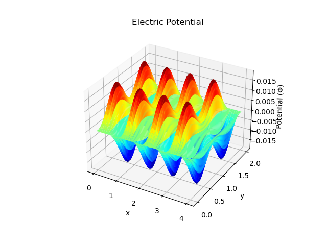
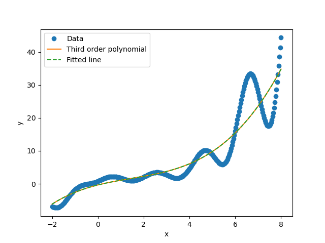
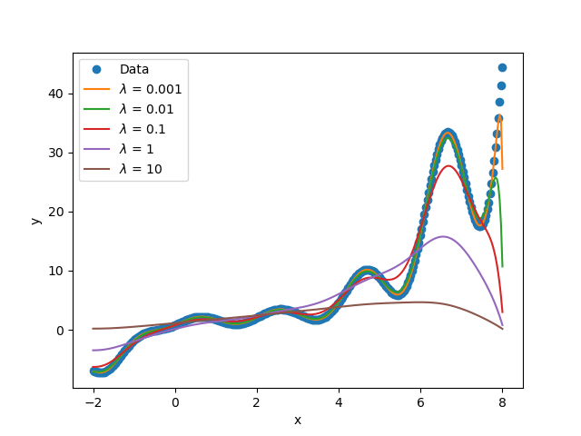
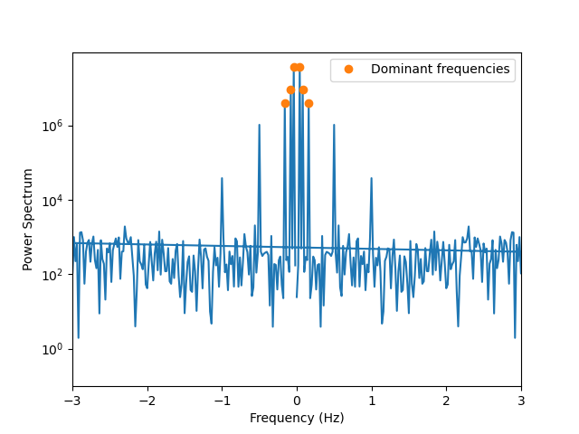

## Problem 1
The electric potential for the charge density, $\rho(x, y) = sin(2 \pi x) sin^2(\pi y)$, is given by this plot below:

## Problem 2 and 3
I made a third order polynomial fit using a custom-made function `FitDatatoLine` and the `numpy` function `polyfit`. The results are shown below:

I also made a plot with different $\lambda$ values to fit the data and smaller $\lambda$ values seem to fit the data better. The results are shown below:

## Problem 4
Here is the power spectrum of the data:

The three most dominant frequencies are:
1. 0.15992 Hz
2. 0.07996 Hz
3. 0.03998 Hz